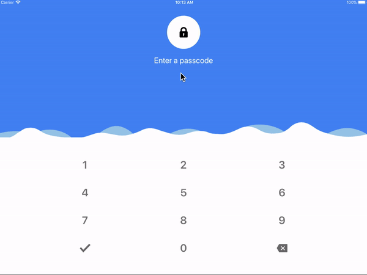
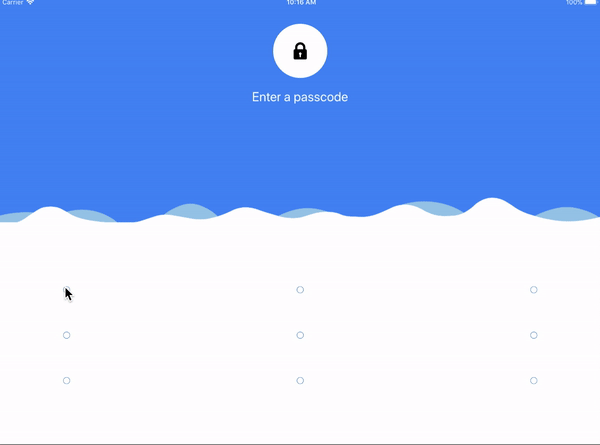
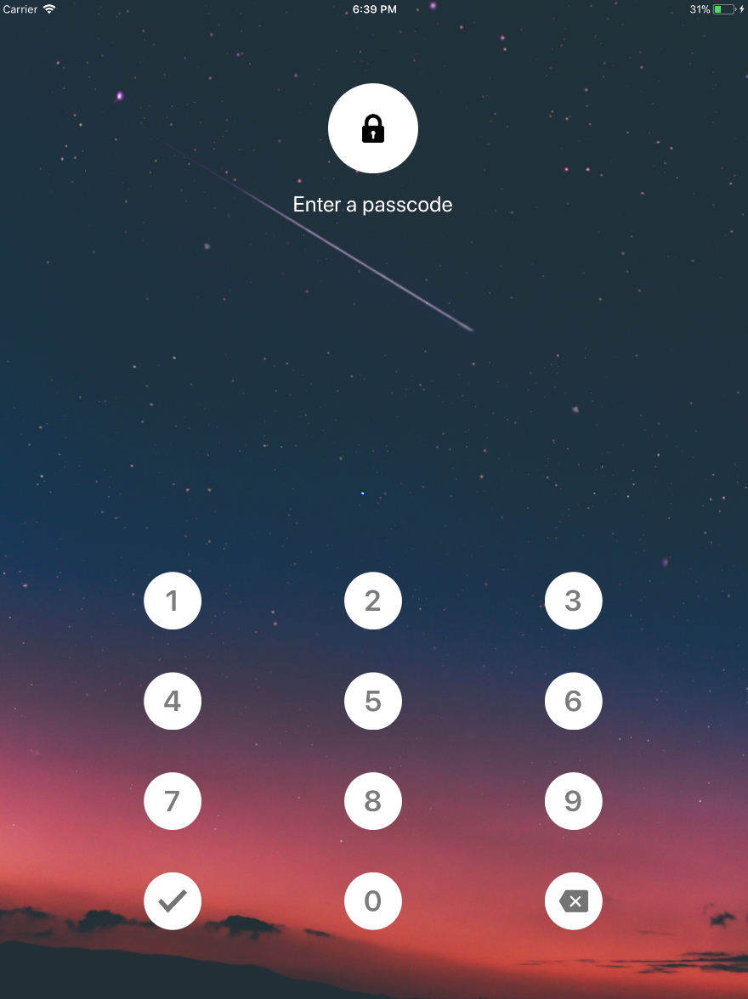

<h1 align="center">

<p align="center">
  <a href="https://www.npmjs.com/package/react-native-lock-screen"></a>
  <a href="https://github.com/prscX/react-native-lock-screen/pulls"></a>
  <a href="https://github.com/prscX/react-native-lock-screen#License"></a>
</p>

    ReactNative: Lock Screen (Android/iOS)

If this project has helped you out, please support us with a star 🌟
</h1>

An easy-to-use, customizable and Material Design ready Pattern/Pin Lock view for Android & iOS.

| **Pin** |
| ----------------- |
|                   |

| **Pattern** |
| ----------------- |
|                   |

| **With Background** |
| ----------------- |
|                   |

## 📖 Getting started

`$ yarn add react-native-lock-screen --save`

## **RN60 >= RNLS V1 >**

> RN60 above please use `react-native-lock-screen` V1 and above

`$ yarn add react-native-lock-screen`

`$ yarn add react-native-svg`

`$ yarn add react-native-vector-icons`

- **iOS**

> **iOS Prerequisite:** Please make sure `CocoaPods` is installed on your system

	- Add the following to your `Podfile` -> `ios/Podfile` and run pod update:

```
  use_native_modules!

  pod 'RNLockScreen', :path => '../node_modules/react-native-lock-screen/ios'
```

- **Android**

## **RN60 < RNLS V1 <**

> RN60 below please use `react-native-lock-screen` V.0.*

`$ react-native link react-native-lock-screen`

`$ react-native link react-native-svg`

`$ react-native link react-native-vector-icons`

- **Android**
  - Please add below snippet into your app `build.gradle`

```
buildscript {
    repositories {
      jcenter()
      maven { url "https://maven.google.com" }
		...
    }
	...
}


allprojects {
    repositories {
      maven { url 'https://jitpack.io' }
		  maven { url "https://maven.google.com" }
		...
    }
}
```

> **Note:** This library is support on Android 27 > above


- **iOS**

- After `react-native link react-native-lock-screen`, please verify `node_modules/react-native-lock-screen/ios/` contains Pods folder. If does not exist please execute `pod install` command on `node_modules/react-native-lock-screen/ios/`, if any error => try `pod repo update` then `pod install`

## 💻 Usage

```javascript
import RNLockScreen from 'react-native-lock-screen';

<RNLockScreen type={RNLockScreen.Type.Pin} mode={RNLockScreen.Mode.Capture} onCapture={lock => {
  }} onVerified={() => {

  }}
  lock={'123'}
/>

```

## 💡 Props

| Prop              | Type       | Default | Note                                                                                                       |
| ----------------- | ---------- | ------- | ---------------------------------------------------------------------------------------------------------- |
| `type`       | `number`     |   Pin - 0     | Specify type of lock (Pin/Pattern)
| `mode`       | `number`     |   Capture - 0     | Specify mode of lock (Capture/Verify)
| `lock`       | `string`     |        | Specify lock then the mode is Verify
| `lockLimit`       | `number`     |    `4`    | Specify lock limit of lock
| `clearLockOnError`       | `bool`     |    `true`    | Specify clear flag on error, it will automatically reset pin visualize state to it's default
| `onCapture`       | `func`     |        | Specify onCapture event function, this is invoked once passcode is captured
| `onVerified`       | `func`     |        | Specify onVerified event function, this is invoked when the passcode is verified
| `backgroundImage`       | `number` : `optional`     |        | Specify lock screen background image
| `renderHeaderFragment`       | `func` : `optional`     |        | Specify func to customize header fragment
| `renderSeparator`       | `func` : `optional`     |        | Specify func to customize separator
| `renderLockFragment`       | `func` : `optional`     |        | Specify func to customize lock fragment
| `patternProps`       | `object` : `optional`     |        | Specify obj to pass pattern props
| `pinProps`       | `object` : `optional`     |        | Specify obj to pass pin props
| `headerFragmentProps`       | `object` : `optional`     |        | Specify obj to pass header fragment props
| `lockFragmentProps`       | `object` : `optional`     |        | Specify obj to pass lock fragment props
| `defaultState`       | `object` : `optional`     |        | Specify obj to pass `DEFAULT` state props
| `reenterState`       | `object` : `optional`     |        | Specify obj to pass `REENTER` state props
| `successState`       | `object` : `optional`     |        | Specify obj to pass `SUCCESS` state props
| `errorState`       | `object` : `optional`     |        | Specify obj to pass `error` state props
| `confirmPin`       | `object` : `optional`     |        | Specify obj to pass `confirm pin` state props
| `deletePin`       | `object` : `optional`     |        | Specify obj to pass `delete pin` state props


- **Default State Props: defaultState**

| Prop              | Type       | Default | Note                                                                                                       |
| ----------------- | ---------- | ------- | ---------------------------------------------------------------------------------------------------------- |
| `title`       | `string`     |   Enter a passcode     | Specify the header fragment title
| `titleStyle`       | `string`     |  `{ fontSize: 24, color: "#FFF" }`      | Specify title style
| `icon`       | `string`     |   lock icon     | Specify the header circle icon
| `dotProps`       | `string`     |   `style: { backgroundColor: "#FFF" }`     | Specify the Dot component props


- **Reenter State Props: reenterState**

| Prop              | Type       | Default | Note                                                                                                       |
| ----------------- | ---------- | ------- | ---------------------------------------------------------------------------------------------------------- |
| `title`       | `string`     |   Enter a passcode     | Specify the header fragment title
| `titleStyle`       | `string`     |  `{ fontSize: 24, color: "#FFF" }`      | Specify title style
| `icon`       | `string`     |   lock icon     | Specify the header circle icon
| `dotProps`       | `string`     |   `style: { backgroundColor: "#FFF" }`     | Specify the Dot component props

- **Success State Props: successState**

| Prop              | Type       | Default | Note                                                                                                       |
| ----------------- | ---------- | ------- | ---------------------------------------------------------------------------------------------------------- |
| `title`       | `string`     |   Enter a passcode     | Specify the header fragment title
| `titleStyle`       | `string`     |  `{ fontSize: 24, color: "#FFF" }`      | Specify title style
| `icon`       | `string`     |   lock icon     | Specify the header circle icon
| `dotProps`       | `string`     |   `style: { backgroundColor: "#037d50" }`     | Specify the Dot component props

- **Error State Props: errorState**

| Prop              | Type       | Default | Note                                                                                                       |
| ----------------- | ---------- | ------- | ---------------------------------------------------------------------------------------------------------- |
| `title`       | `string`     |   Enter a passcode     | Specify the header fragment title
| `titleStyle`       | `string`     |  `{ fontSize: 24, color: "#FFF" }`      | Specify title style
| `icon`       | `string`     |   lock icon     | Specify the header circle icon
| `dotProps`       | `string`     |   `style: { backgroundColor: "#be0000" }`     | Specify the Dot component props


- **Pin Props**

| Prop              | Type       | Default | Note                                                                                                       |
| ----------------- | ---------- | ------- | ---------------------------------------------------------------------------------------------------------- |
| `confirmPin`       | `string`     |     | Specify text/icon/style of confirm pin
| `deletePin`       | `string`     |      | Specify text/icon/style of delete pin
| `rippleProps`       | `string`     |      | Specify props of ripple. Please refer [react-native-material-ripple](https://github.com/n4kz/react-native-material-ripple)
| `containerStyle`       | `string`     |      | Specify style of root container
| `textStyle`       | `string`     |      | Specify style of text displayed
| `suggestionStyle`       | `string`     |      | Specify style of suggestion displayed
| `alphabetPinSuggestion`       | `bool`     |  `true`    | Enable/Disable alphabet suggestion


- **Confirm/Delete Pin Props**

| Prop              | Type       | Default | Note                                                                                                       |
| ----------------- | ---------- | ------- | ---------------------------------------------------------------------------------------------------------- |
| `title`       | `string`     |     | Specify text of confirm pin
| `icon`       | `string`     |   Confirm Icon/Delete Icon    | Specify icon of confirm pin
| `style`       | `string`     |      | Specify style of title/icon


## ✨ Credits

- [Android: Gesture Lock - aritraroy/PatternLockView](https://github.com/aritraroy/PatternLockView)
- [iOS: Gesture Lock - Tuqierrenzu/TQGestureLockView](https://github.com/Tuqierrenzu/TQGestureLockView)
- [Android/iOS: Design - hanks-zyh/PasscodeView](https://github.com/hanks-zyh/PasscodeView)

## 🤔 How to contribute
Have an idea? Found a bug? Please raise to [ISSUES](https://github.com/prscX/react-native-lock-screen/issues).
Contributions are welcome and are greatly appreciated! Every little bit helps, and credit will always be given.

## 💫 Where is this library used?
If you are using this library in one of your projects, add it in this list below. ✨


## 📜 License
This library is provided under the Apache License.

RNLockScreen @ [prscX](https://github.com/prscX)

## 💖 Support my projects
I open-source almost everything I can, and I try to reply everyone needing help using these projects. Obviously, this takes time. You can integrate and use these projects in your applications for free! You can even change the source code and redistribute (even resell it).

However, if you get some profit from this or just want to encourage me to continue creating stuff, there are few ways you can do it:
* Starring and sharing the projects you like 🚀
* If you're feeling especially charitable, please follow [prscX](https://github.com/prscX) on GitHub.

  <a href="https://www.buymeacoffee.com/prscX" target="_blank"></a>

  Thanks! ❤️
  <br/>
  [prscX.github.io](https://prscx.github.io)
  <br/>
  </ Pranav >